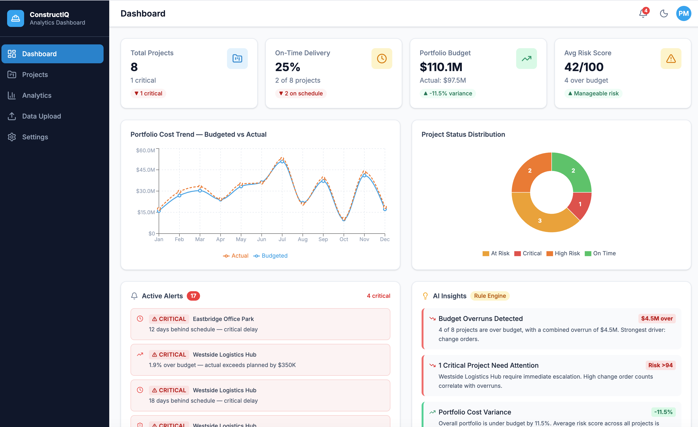

# ConstructIQ — Construction Analytics Dashboard

**Live demo:** https://construction-dashboard-dusky.vercel.app



A portfolio project demonstrating how AI and data analysis skills can turn raw construction project data into actionable operational intelligence — the kind of capability that extends Procore's value without replacing it.

---

## The Problem

Construction companies using **Procore** accumulate rich data: project timelines, budgets, change orders, subcontractor performance, safety records, task completion rates. Most of that data surfaces in dashboards that show *what happened* — not *what is about to go wrong*.

Project managers end up reacting to problems rather than preventing them. A project that is 3 days late and 5% over budget today can become a 3-week delay and a $400K overrun by close — if no one flags the trend early enough.

---

## What This Demonstrates

### Rule-Based AI Risk Engine
The analytics engine (`src/lib/analytics.ts`) mirrors the logic you would want embedded in a Procore integration or any construction ops platform:

- Projects are automatically classified: **On Time → At Risk → High Risk → Critical**
- A **risk score (0–100)** is computed from three weighted signals:
  - Schedule delay — up to 50 pts
  - Budget overrun — up to 30 pts
  - Delayed task count — up to 20 pts
- Alerts are auto-generated and severity-ranked across the full portfolio
- Insights are synthesized at the portfolio level (e.g., identifying that change orders are the primary cost driver across multiple at-risk projects)

### Portfolio-Level Visibility

| Metric | Purpose |
|---|---|
| On-Time Delivery % | Schedule health across all projects |
| Portfolio Budget vs Actual | Total cost exposure at a glance |
| Average Risk Score | Where to direct attention first |
| Active Alerts | What needs action today |

### Data Ingestion
The **Data Upload** page accepts CSV — the export format Procore and most ERP systems support. Drop in a file and the entire dashboard rebuilds: KPIs, charts, alerts, and insights all update from the new dataset. This is the foundation for a real integration: pull from the source system, normalize, analyze.

---

## The Broader Pattern

The same architecture applied here to construction data generalizes directly to other operational domains:

| Domain | Data Source | Analytics Value |
|---|---|---|
| Construction | Procore | Schedule risk, cost forecasting, subcontractor performance |
| Human Resources | HRIS / ATS | Turnover signals, hiring funnel health, headcount planning |
| Logistics | ERP / TMS | Delivery delay patterns, vendor risk scoring |

---

## Stack

| Layer | Technology |
|---|---|
| Framework | React 19 + TypeScript |
| Styling | Tailwind CSS v4 |
| Charts | Recharts |
| Build | Vite + Bun |

No backend required. Deployable as a static app and connectable to any REST API or CSV export from Procore, SAP, Workday, or a custom system.

---

## Running Locally

```bash
# Install bun if needed
curl -fsSL https://bun.sh/install | bash

git clone https://github.com/incastil/construction-dashboard.git
cd construction-dashboard
bun install
bun run dev
```

Open `http://localhost:5173`

---

## Project Structure

```
src/
├── lib/
│   ├── analytics.ts      # Risk scoring, alert generation, portfolio insights
│   └── formatters.ts     # Currency, percent, date helpers
├── data/
│   └── mockProjects.ts   # 8 realistic Procore-style projects
├── hooks/
│   ├── useProjects.ts    # Central data, filter, and sort state
│   └── useTheme.ts       # Dark mode with localStorage persistence
├── components/           # Cards, charts, table, alerts, insights
└── pages/                # Dashboard, Projects, Analytics, Upload, Settings
```

---

## Roadmap

- **Procore API integration** — OAuth + REST to pull live project, budget, and RFI data
- **LLM layer** — Reason over unstructured change order descriptions and RFI notes
- **HR module** — Same architecture applied to headcount and attrition data
- **Logistics module** — Delivery performance and vendor risk scoring
- **Role-based views** — PM sees their projects; leadership sees the portfolio
